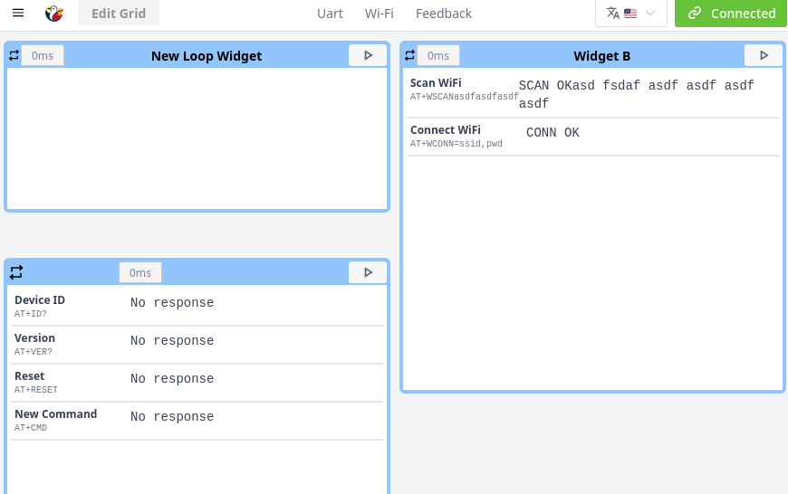
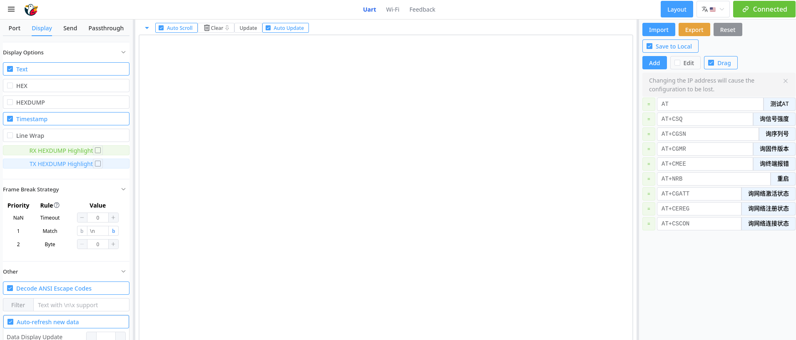

# wireless-esp32-tools 网页用户界面

本项目是 [wireless-esp32-tools](https://github.com/kerms/wireless-esp32-tools) 项目的网页用户界面。

`wireless-esp32-tools` 项目为多种ESP芯片提供了兼容CMSIS-DAP的无线调试工具，可将ESP芯片变为一个功能强大的无线调试器。

## 关于此网页界面

此Web应用程序提供了一个用户友好的仪表板，用于管理您的 `wireless-esp32-tools` 设备并与之交互。它采用 Vue.js 3、Vite 和 Element Plus 构建，并设计为直接托管在 ESP32 上。

通过此界面，您可以构建一个自定义的仪表板来监控目标设备并与之交互。

### 主要功能

*   **Wi-Fi配置**：包括终端模式(STA)和热点模式(AP)，支持静态/动态IP地址分配和DNS设置。
*   **动态组件仪表板**：一个完全灵活的基于网格的面板。
*   **实时数据可视化**：包括一个用于监控目标设备串行通信的UART数据查看器。
*   **嵌入式优先设计**：部署为单个.html文件以减少http连接数。
*   **适用于小屏幕设计**：响应式布局适配移动设备和平板电脑，具有触摸友好的控件和针对小屏幕优化的UI元素。

## 界面截图

**组件面板**


**UART数据显示**


## 使用说明

### 最终用户

1.  将您的计算机或移动设备连接到运行 `wireless-esp32-tools` 的ESP32所承载的Wi-Fi网络。
2.  打开Web浏览器并导航到ESP32设备的IP地址（例如 `http://dap.local` 或 `http://192.168.1.1`(连接AP的情况下)）。

### 开发人员 (针对此Web UI)

请按照以下步骤设置项目以进行本地开发或构建以进行部署。

#### 环境准备

*   [Node.js](https://nodejs.org/) (v16 或更高版本)
*   [npm](https://www.npmjs.com/)

#### 本地开发

1.  **安装依赖：**
    ```sh
    npm install
    ```
2.  **运行开发服务器：**
    ```sh
    npm run dev
    ```
    这将在本地启动一个服务器，通常地址为 `http://localhost:5173`。

3.  **为移动/远程调试运行：**
    要从同一网络上的其他设备（如手机）访问开发服务器，请使用：
    ```sh
    npm run devh
    ```
    这将把服务器暴露给您的本地网络（例如 `http://192.168.X.X:5173`）。

#### 构建生产版本 (部署到ESP32)

1.  **构建项目：**
    ```sh
    npm run build
    ```
    此命令将编译和打包应用程序到 `dist/` 目录，生成 `index.html` 和 `ws.sharedworker.js`。

2.  **压缩输出文件：**
    进入 `dist/` 目录并使用gzip压缩构建产物。
    ```sh
    cd dist
    gzip *
    ```
    这将生成 `index.html.gz` 和 `ws.sharedworker.js.gz`。

3.  **部署到ESP32：**
    将压缩后的 `.gz` 文件复制到您的 `wireless-esp32-tools` ESP-IDF项目中的相应目录（例如 `project_components/html/`），然后将固件刷入您的设备。

## 许可证

根据MIT许可证分发。更多信息请参见 `LICENCE.txt` 文件。 